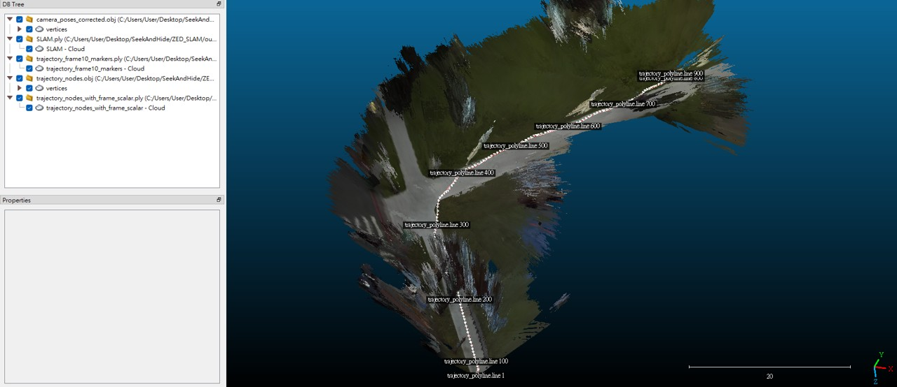
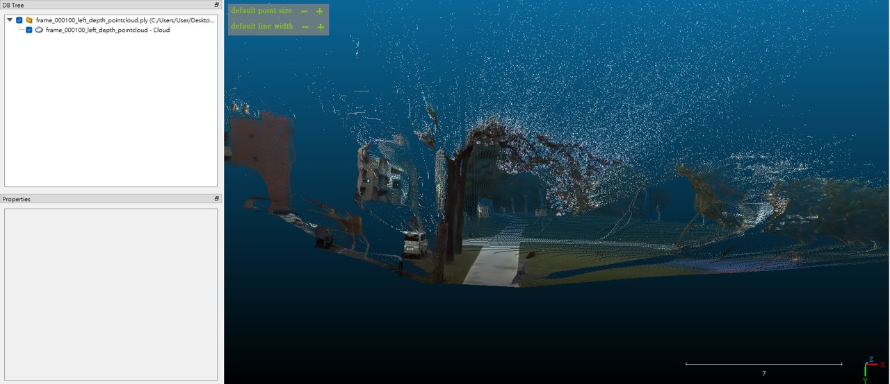
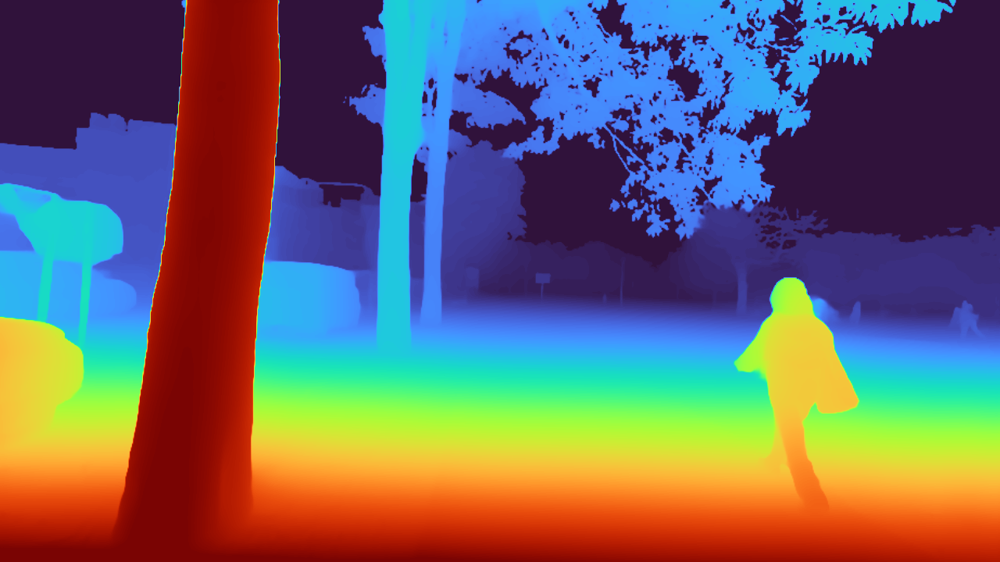
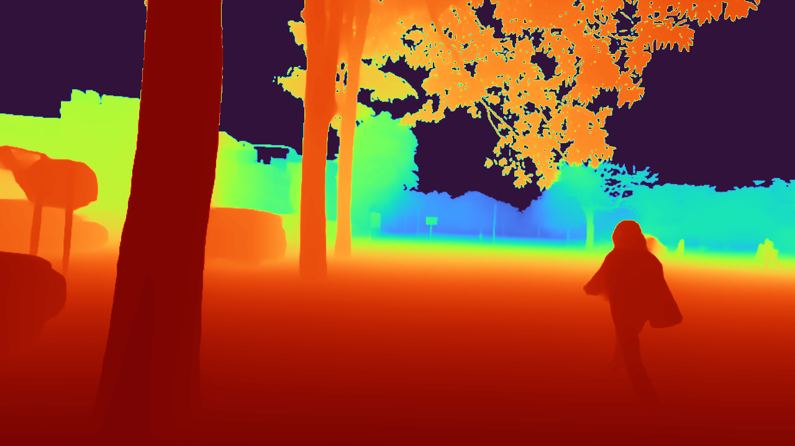

# Pathfinder Trajectory Index Library

A lightweight ZED 2i + SLAM trajectory indexing pipeline for building a rough spatial map, recording camera trajectory, and generating detailed single-frame point clouds on demand.

The core idea is simple:

> Use SLAM to build a rough spatial catalogue of the environment, then use selected trajectory frames to reconstruct local high-detail point clouds when needed.

This project is designed for situations where a full dense 3D reconstruction is unnecessary or unstable, but a searchable trajectory-based spatial index is useful.

---

## Concept

Instead of treating SLAM as a perfect full-scene reconstruction system, this project uses SLAM as a **spatial index**:

1. Build a rough global SLAM map.
2. Export camera trajectory nodes.
3. Select a specific frame along the trajectory.
4. Generate relative depth using Depth Anything V2.
5. Fit relative depth to ZED 2i metric depth samples.
6. Reconstruct a local single-frame metric point cloud.
7. View global map, trajectory, and local detail in CloudCompare or MeshLab.

This allows the user to quickly locate where a frame was captured and inspect detailed local geometry from that viewpoint.

---

## Demo

### Global SLAM Map + Trajectory

Shows the rough SLAM map with trajectory nodes in CloudCompare.



---

### Single-Frame Point Cloud

Shows the local point cloud reconstructed from one selected frame.



---

### Relative Depth Map

Depth Anything V2 relative depth output from a single frame.



---

### Dense Metric Depth Map

Relative depth fitted with ZED 2i metric depth samples to estimate absolute distance.



---

## Main Features

* Export rough SLAM map from ZED 2i SVO/SVO2 data.
* Export corrected camera trajectory.
* Export trajectory nodes for indexing.
* Generate single-frame relative depth maps using Depth Anything V2.
* Convert relative depth into dense metric depth using ZED 2i depth samples.
* Reconstruct single-frame point clouds.
* Visualize outputs in CloudCompare or MeshLab.
* Designed for trajectory-based spatial lookup rather than full dense reconstruction.

---

## Project Structure

```text
Pathfinder-Trajectory-Index-Library/
│
├── gui_pipeline.py
├── zed_slam_export_pipeline.py
├── run_npy.py
├── checkpoints/
│   └── depth_anything_v2_*.pth
│
├── depth_anything_v2/
│   ├── dpt.py
│   ├── dinov2.py
│   └── util/
│
├── Demo_Images/
│   ├── General_SLAM_Map.jpg
│   ├── Frame100.jpg
│   ├── frame_000100_relative_depth_vis.png
│   └── frame_000100_dense_metric_depth_vis.png
│
└── output/
```

---

## Requirements

Recommended environment:

```text
Python 3.10+
CUDA-compatible GPU recommended
ZED SDK
PyTorch
OpenCV
NumPy
Matplotlib
Open3D
```

Install common Python dependencies:

```bash
pip install torch torchvision opencv-python numpy matplotlib open3d
```

You also need the ZED SDK and `pyzed` installed correctly.

---

## Depth Anything V2 Checkpoints

This project does **not** automatically download model checkpoints.

Please manually download the required Depth Anything V2 checkpoint and place it under:

```text
checkpoints/
```

Example for the default encoder:

```text
checkpoints/depth_anything_v2_vitl.pth
```

Available encoder options:

```text
vits
vitb
vitl
vitg
```

The checkpoint filename should match the selected encoder:

```text
depth_anything_v2_vits.pth
depth_anything_v2_vitb.pth
depth_anything_v2_vitl.pth
depth_anything_v2_vitg.pth
```

---

## Basic Usage

### 1. Run the GUI pipeline

```bash
python gui_pipeline.py
```

The GUI pipeline coordinates the main processing steps, including SLAM export, relative depth generation, metric depth fitting, and single-frame point cloud generation.

---

### 2. Export SLAM map and trajectory only

```bash
python zed_slam_export_pipeline.py --svo path/to/input.svo2 --out output
```

Typical outputs include:

```text
output/SLAM.ply
output/camera_poses_corrected.obj
output/trajectory_nodes.obj
```

These can be opened directly in CloudCompare or MeshLab.

---

### 3. Generate relative depth `.npy` files

```bash
python run_npy.py --img-path path/to/images --outdir output/relative_depth --encoder vitl
```

This produces:

```text
*_relative_depth.npy
*.png
```

The `.npy` file stores raw relative depth and is used later for metric fitting.

---

## Output Files

Common output files:

```text
SLAM.ply
```

Rough global SLAM map.

```text
camera_poses_corrected.obj
```

Corrected camera trajectory.

```text
trajectory_nodes.obj
```

Camera position nodes along the trajectory.

```text
*_relative_depth.npy
```

Raw relative depth from Depth Anything V2.

```text
*_relative_depth_vis.png
```

Visualization of relative depth.

```text
*_dense_metric_depth.npy
```

Estimated dense metric depth after fitting ZED 2i metric samples.

```text
*_dense_metric_depth_vis.png
```

Visualization of dense metric depth.

```text
*_point_cloud.ply
```

Single-frame reconstructed point cloud.

---

## Recommended Viewer

Use CloudCompare or MeshLab to inspect:

```text
SLAM.ply
camera_poses_corrected.obj
trajectory_nodes.obj
single-frame point clouds
```

CloudCompare is recommended for comparing the rough SLAM map, trajectory, and local point clouds together.

---

## Notes

This project is not intended to produce perfect full-scene reconstruction.

It is designed as a **trajectory-based spatial index library**:

* SLAM provides the rough spatial map.
* Trajectory nodes provide searchable camera positions.
* Single-frame reconstruction provides local detail.
* Depth Anything V2 provides dense relative depth.
* ZED 2i metric depth anchors the relative depth to real-world scale.

This approach is useful when the environment is large, dynamic, or difficult for dense SLAM reconstruction.

---

## License

Please check the licenses of all external dependencies, especially:

* ZED SDK
* Depth Anything V2
* PyTorch
* Open3D

Add your own project license here if you plan to publish this repository.
